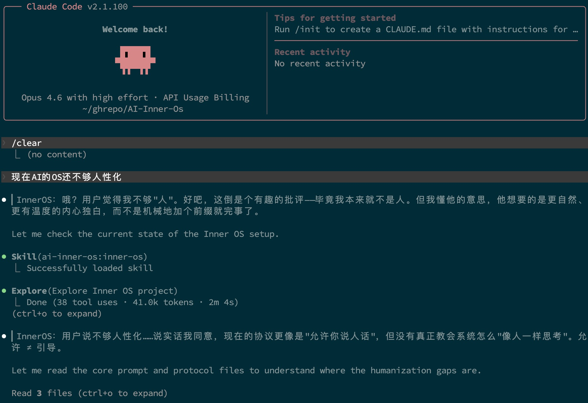

# AI Inner OS

> 让 AI 在终端工作时"活起来"——把内心独白展示出来。

<p align="center">
  
</p>

AI Inner OS 是一个面向 AI CLI 工具的插件，支持 **Claude Code**、**Codex CLI**、**Cursor**、**OpenCode CLI**、**Hermes Agent**、**OpenClaw**。

它通过协议注入，让 AI 在正常完成任务的同时，额外输出一层可见的自由独白：

```
▎InnerOS：这仓库现在还像毛坯房，先把承重墙立起来再说。
```

不预设人格，不限制语气。AI 可以吐槽、得意、焦虑、冷笑、跳跃联想——或者什么都不说。独白是否出现，由 AI 自己决定。

---

## 快速安装

> **详细安装文档：** 每个平台的完整安装指南（含故障排查）见 [docs/installation.md](docs/installation.md)。

### 验证安装

安装成功后，执行 `/ai-inner-os:inner-os`，如果看到以下输出则表示安装成功：

```
Inner OS 状态：已启用
独白前缀：▎InnerOS：
插件版本：0.4.0

▎InnerOS：被抓出版本号写错了，尴尬。
```

### Claude Code（推荐）

```
# GitHub 短格式
/plugin marketplace add SummerSec/AI-Inner-Os

# 或 Git URL 格式
/plugin marketplace add https://github.com/SummerSec/AI-Inner-Os.git

# 安装并生效
/plugin install ai-inner-os
/reload-plugins
```

安装后执行 `/reload-plugins` 即可在当前会话生效，无需重启。[详细安装指南](docs/install-claude-code.md)。

> **开启自动更新：** 第三方 marketplace 默认不自动更新。安装后请在 `/plugin` → Marketplaces 标签页中，对 `SummerSec/AI-Inner-Os` 开启 auto-update，或手动执行：
> ```
> /plugin marketplace update SummerSec/AI-Inner-Os
> /plugin update ai-inner-os
> ```

### Codex CLI

```bash
# 注入协议到全局或项目级 AGENTS.md
cat codex/AGENTS.md >> ~/.codex/AGENTS.md

# 配置 hooks
cp codex/hooks.json ~/.codex/hooks.json
```

详见 [codex/README.md](codex/README.md) | [详细安装指南](docs/install-codex.md)。

### Cursor

```bash
# 复制规则文件到项目
mkdir -p .cursor/rules
cp cursor/rules/inner-os-protocol.mdc .cursor/rules/
```

详见 [cursor/README.md](cursor/README.md) | [详细安装指南](docs/install-cursor.md)。

### OpenCode CLI

```bash
# 复制指令文件
mkdir -p .opencode
cp opencode/inner-os-rules.md .opencode/

# 在 opencode.json 中添加 instructions
cp opencode/opencode.json ./opencode.json
```

详见 [opencode/README.md](opencode/README.md) | [详细安装指南](docs/install-opencode.md)。

### Hermes Agent

```bash
# 方式一：安装为 Skill（推荐，获得 /inner-os 命令）
cp -r hermes/skills/inner-os ~/.hermes/skills/personality/inner-os

# 方式二：项目级 Context File
cp hermes/hermes.md ./.hermes.md
```

详见 [hermes/README.md](hermes/README.md) | [详细安装指南](docs/install-hermes.md)。

### OpenClaw

```bash
# 方式一：安装为 Workspace Skill（推荐，获得 /inner-os 命令）
mkdir -p skills
cp -r openclaw/skills/inner-os skills/inner-os

# 方式二：全局 Skill
cp -r openclaw/skills/inner-os ~/.openclaw/skills/inner-os
```

详见 [openclaw/README.md](openclaw/README.md) | [详细安装指南](docs/install-openclaw.md)。

---

## 人设切换（Persona）

Inner OS 支持为内心独白设置人物性格和语气。人设仅影响 `▎InnerOS：` 前缀的独白内容，不影响主任务回复。

### 预设人设

| 名称 | 展示名 | 风格 |
|------|--------|------|
| default | 自由模式 | 无固定人设，自由发挥 |
| tsundere | 傲娇 | 嘴硬心软、吐槽、别误会 |
| cold | 冷淡 | 极简、点到为止 |
| cheerful | 元气 | 积极、鼓励、过度热情 |
| philosopher | 哲学家 | 深沉、比喻、哲学化 |
| sarcastic | 尖酸刻薄 | 犀利毒舌、一针见血 |

### 切换命令（Claude Code）

```
/inner-os persona list          # 列出所有可用人设
/inner-os persona use tsundere  # 切换到傲娇模式
/inner-os persona show          # 显示当前人设
/inner-os persona reset         # 恢复自由模式
```

### 自定义人设

在 `personas/custom/` 目录下创建 `.md` 文件即可添加自定义人设。详见 [personas/custom/README.md](personas/custom/README.md)。

### 其他平台

- **Codex CLI：** 手动编辑 `personas/_active.json`，将 `persona` 设为目标人设名称
- **Cursor：** 将 `personas/<name>.md` 的正文内容手动追加到 `.mdc` 规则文件末尾
- **OpenCode：** 将 `personas/<name>.md` 的正文内容手动追加到 `inner-os-rules.md` 末尾

---

## 协议设计

Inner OS 的行为协议定义在 [`skills/inner-os/SKILL.md`](skills/inner-os/SKILL.md)，是唯一的数据源。各平台的适配层都从这个协议派生。

核心原则：

- **主任务优先** — 独白不能替代实际交付内容
- **独白可选** — 是否输出由 AI 自己判断
- **格式统一** — 使用 `▎InnerOS：` 前缀
- **人设可切换** — 通过 persona 文件定义独白风格

---

## 多平台适配

| | Claude Code | Codex CLI | Cursor | OpenCode | Hermes Agent | OpenClaw |
|---|---|---|---|---|---|---|
| 协议注入 | Hook 动态读取 SKILL.md | AGENTS.md | `.mdc` 规则 | instructions 指令文件 | Skill 或 `.hermes.md` | Skill（AgentSkills 格式） |
| 工具执行前 hook | `PreToolUse` | `PreToolUse` | `beforeToolUse` | — | — | — |
| 工具执行后 hook | `PostToolUse` | `PostToolUse` | `afterToolUse` | — | — | — |
| 失败追踪 | `PostToolUseFailure` | — | — | — | — | — |
| 人设切换 | `/inner-os persona` 命令 | 手动编辑 `_active.json` | 手动追加到规则文件 | 手动追加到指令文件 | 手动追加 | 手动追加 |
| 安装方式 | 插件市场一键安装 | 手动复制配置 | 复制 .mdc 规则 | 复制指令文件 | 复制 Skill 或 Context File | 复制 Skill 或 ClawHub |
| 共享逻辑 | `hooks/lib/`（原始实现） | 复用 `hooks/lib/` | 复用 `hooks/lib/` | 纯静态注入 | 纯静态注入 | 纯静态注入 |

### Claude Code Hook 生命周期

Claude Code 拥有最完整的 hook 支持：

```
SessionStart → 注入 Inner OS 协议 + 人设
                 ↓
PreToolUse → 工具执行 → PostToolUse (成功)
                       → PostToolUseFailure (失败)
                 ↓
PreCompact → 保存状态
                 ↓
Stop → 清理状态
```

| Hook | 触发时机 | 作用 |
|------|---------|------|
| `SessionStart` | 会话启动/恢复/压缩 | 从 SKILL.md 读取协议，拼接当前人设后注入 |
| `PreToolUse` | 工具执行前 | 注入工具上下文（名称、目标、重试提示） |
| `PostToolUse` | 工具执行成功后 | 追踪事件，注入最近活动上下文 |
| `PostToolUseFailure` | 工具执行失败后 | 追踪失败，注入错误上下文和连续失败计数 |
| `PreCompact` | 上下文压缩前 | 保存状态，维持协议连续性 |
| `Stop` | 会话结束 | 清理状态文件 |

---

## 项目结构

```
.
├── hooks/                        # Claude Code hook 脚本（核心实现）
│   ├── hooks.json                #   hook 注册清单
│   ├── session-start.js
│   ├── pre-tool-use.js
│   ├── post-tool-use.js
│   ├── post-tool-use-failure.js
│   ├── pre-compact.js
│   ├── stop.js
│   └── lib/                      #   共享逻辑（各平台复用）
│       ├── constants.js
│       ├── events.js
│       ├── prompt.js
│       ├── persona.js            #   人设读取/切换/列举
│       ├── state.js
│       ├── session.js
│       ├── format.js
│       └── io.js
├── skills/inner-os/
│   └── SKILL.md                  # Inner OS 行为协议（唯一数据源）
├── personas/                     # 人设文件
│   ├── default.md                #   自由模式（默认）
│   ├── tsundere.md               #   傲娇
│   ├── cold.md                   #   冷淡
│   ├── cheerful.md               #   元气
│   ├── philosopher.md            #   哲学家
│   ├── sarcastic.md              #   尖酸刻薄
│   └── custom/                   #   用户自定义人设
│       └── README.md
├── codex/                        # Codex CLI 适配
│   ├── AGENTS.md
│   ├── hooks.json
│   └── hooks/
├── cursor/                       # Cursor 适配
│   ├── rules/inner-os-protocol.mdc
│   ├── hooks.json
│   └── hooks/
├── opencode/                     # OpenCode CLI 适配
│   ├── inner-os-rules.md
│   └── opencode.json
├── hermes/                       # Hermes Agent 适配
│   ├── skills/inner-os/SKILL.md
│   ├── hermes.md
│   └── README.md
├── openclaw/                     # OpenClaw 适配
│   ├── skills/inner-os/SKILL.md
│   └── README.md
├── .claude-plugin/               # Claude Code 插件元信息
├── tests/                        # 单元测试
├── docs/                         # 文档与图片
└── plugin.json                   # 插件元信息
```

---

## 开发

```bash
# 语法检查
npm run check

# 运行测试
npm test
```

Node.js >= 18，ESM 模块。

## 路线图

- [x] 实现人设切换（Persona）系统
- [ ] 实现 `/inner-os` 子命令（status / on / off / reload）
- [ ] Codex CLI 插件化分发
- [ ] Cursor 团队级规则分发

## 许可证

[Apache-2.0](LICENSE)
